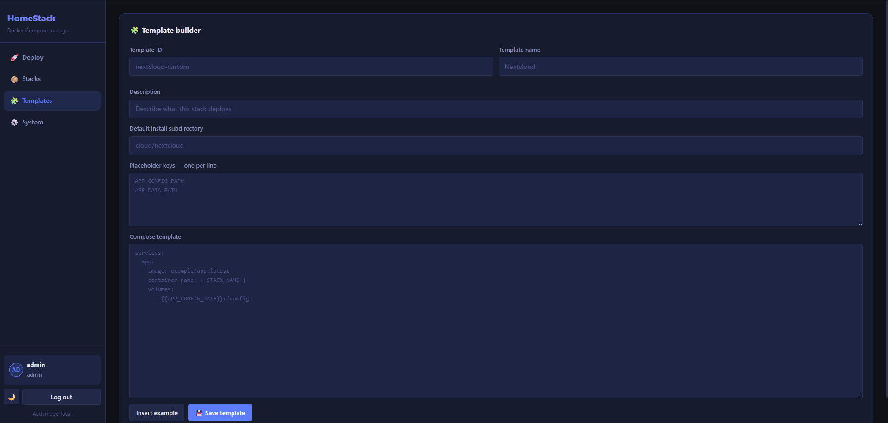

<div align="center">


# HomeStack

**A self-hosted web UI for deploying and managing Docker Compose stacks on your Linux homeserver.**

Built for homelabbers who want a clean, modern interface to deploy, monitor, update, and organise their self-hosted services — without touching the terminal every time.

[](LICENSE)
[](https://python.org)
[](https://fastapi.tiangolo.com)
[](https://docker.com)
[](https://nginx.org)

[Quick Install](#quick-install) · [Features](#features) · [Screenshots](#screenshots) · [Configuration](#configuration) · [Adding Templates](#adding-templates)

</div>

---

## Screenshots

<div align="center">

| Deploy | Stacks |
|--------|--------|
|  |  |

| System Status | Templates |
|--------------|-----------|
|  |  |

</div>

---

## Features

### Core

| | Feature | Description |
|---|---|---|
| 🚀 | **Deploy stacks** | From built-in templates or paste your own `docker-compose.yml` |
| 📦 | **Built-in templates** | Jellyfin, Nextcloud, qBittorrent, Radarr, Sonarr, Bazarr, Prowlarr, Immich, Vaultwarden, Komga, Arr-stack |
| 🧩 | **Custom template builder** | Create reusable templates with placeholder variables |
| 📥 | **Import existing containers** | Auto-generate a compose file from any running container |
| ♻️ | **One-click update** | Pull latest images and redeploy with a single button |

### Visibility

| | Feature | Description |
|---|---|---|
| 🟢 | **Live container status** | Every container on the host with state, image, and ports |
| 💾 | **Disk usage** | Check how much space each stack's data directory is using |
| 🔁 | **Auto-refresh** | Container and stack status refreshes every 30 seconds |
| 🔍 | **Search and filter** | Across stacks and containers |

### Safety

| | Feature | Description |
|---|---|---|
| ⚠️ | **Duplicate detection** | Warns if a stack name or port conflicts with a running container |
| 🔐 | **Local authentication** | JWT-based login — first account becomes admin |
| 🔑 | **Authelia SSO** | Optional, via reverse proxy header |

### UI

| | Feature | Description |
|---|---|---|
| 🌙 | **Dark and light theme** | Persists across sessions |
| 📱 | **Responsive layout** | Works on any screen size |

---

## Quick Install

```bash
curl -fsSL https://raw.githubusercontent.com/ya0903/HomeStack/main/install.sh | bash
```

The script will ask for:
- Install directory (default: `/opt/homestack`)
- Frontend port (default: `7080`)
- Backend port (default: `7079`)

> **Note:** First account you create becomes admin.

---

## Manual Install

**Requirements:** Docker, Docker Compose plugin, Git

```bash
git clone https://github.com/ya0903/HomeStack.git /opt/homestack
cd /opt/homestack

# Create your environment file
cp .env.example .env
nano .env  # set your ports

# Build and start
docker compose -f homestack.yml up -d --build
```

Open `http://your-server-ip:7080` in your browser.

---

## Updating

```bash
cd /opt/homestack
git pull
docker compose -f homestack.yml up -d --build
```

Or re-run the install script — it detects an existing install and updates in place.

---

## Configuration

Copy `.env.example` to `.env` and edit as needed:

| Variable | Default | Description |
|---|---|---|
| `FRONTEND_PORT` | `7080` | Port the web UI is served on |
| `BACKEND_PORT` | `7079` | Port the backend API listens on |
| `AUTH_MODE` | `local` | `local` for built-in auth, `authelia` for SSO |
| `AUTHELIA_LOGIN_URL` | `/` | Redirect URL for Authelia login |
| `AUTHELIA_USER_HEADER` | `Remote-User` | Header Authelia sets with the username |

---

## File Structure

```
HomeStack/
├── homestack.yml              # Docker Compose file for HomeStack itself
├── install.sh                 # One-liner installer
├── .env.example               # Environment variable reference
├── backend/
│   ├── Dockerfile
│   ├── requirements.txt
│   └── app/
│       ├── main.py            # API routes
│       ├── auth.py            # Authentication
│       ├── docker_ops.py      # Docker/Compose operations
│       ├── models.py          # Pydantic models
│       └── templates.py       # Template management
├── frontend/
│   ├── index.html
│   ├── app.js
│   ├── styles.css
│   └── nginx.conf
└── templates/                 # Built-in stack templates
    ├── jellyfin/
    │   ├── template.json
    │   └── docker-compose.yml.tpl
    └── ...
```

> Runtime data (deployed stacks, user database, custom templates) is stored in `data/` — this directory is gitignored. **Back it up.**

---

## Adding Templates

Each template lives in `templates/<name>/` and needs two files:

**`template.json`**
```json
{
  "id": "my-app",
  "name": "My App",
  "description": "What this deploys",
  "default_install_subdir": "apps/my-app",
  "required_placeholders": ["APP_DATA_PATH"],
  "source": "builtin"
}
```

**`docker-compose.yml.tpl`** — standard Compose YAML using `{{PLACEHOLDER}}` syntax:
```yaml
services:
  my-app:
    image: myapp:latest
    container_name: {{STACK_NAME}}
    restart: unless-stopped
    volumes:
      - {{APP_DATA_PATH}}:/data
```

`STACK_NAME` and `INSTALL_PATH` are always available automatically.

You can also create templates directly from the **Template builder** tab in the UI.

---

## Tech Stack

| Layer | Technology |
|---|---|
| Backend | Python 3.12 · FastAPI · Uvicorn |
| Frontend | Vanilla JS · HTML · CSS (no frameworks) |
| Auth | JWT (python-jose) · bcrypt |
| Templates | Jinja2 |
| Proxy | Nginx (Alpine) |
| Runtime | Docker · Docker Compose |

---

## License

MIT — do whatever you want with it.
