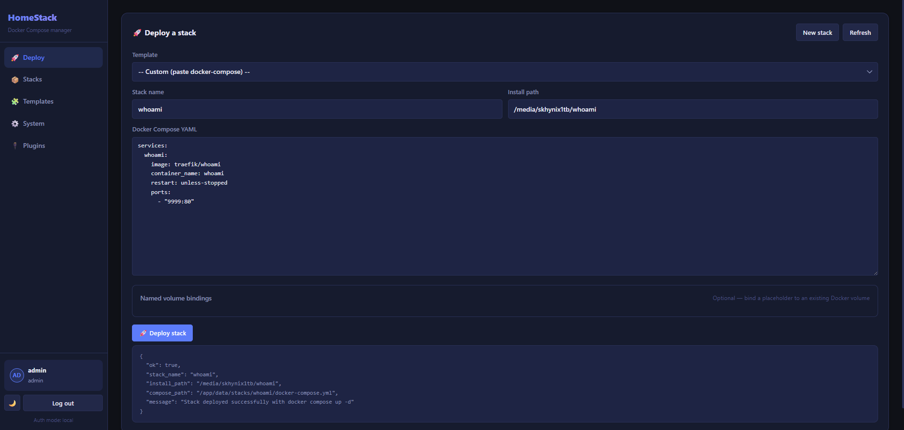
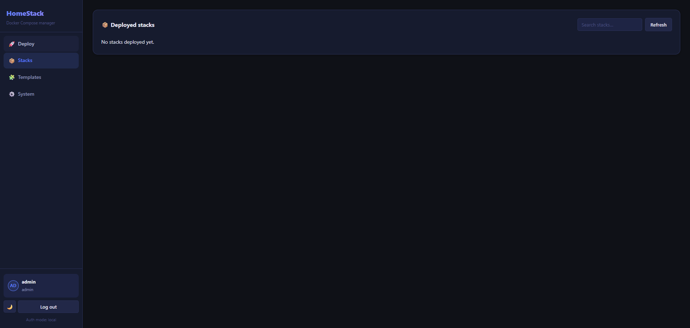
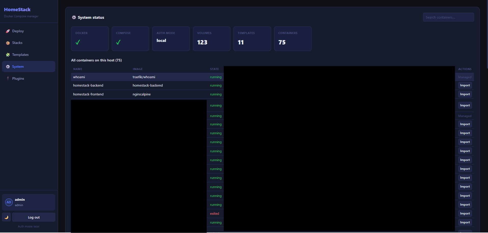
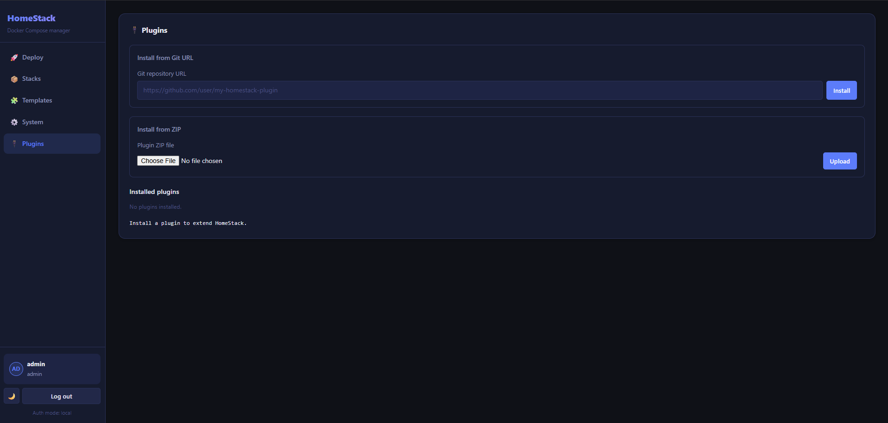

<div align="center">


# HomeStack

**A self-hosted web UI for deploying and managing Docker Compose stacks on your Linux homeserver.**

Built for homelabbers who want a clean, modern interface to deploy, monitor, update, and organise their self-hosted services — without touching the terminal every time.

[](LICENSE)
[](https://python.org)
[](https://fastapi.tiangolo.com)
[](https://docker.com)
[](https://nginx.org)

[Quick Install](#quick-install) · [Features](#features) · [Screenshots](#screenshots) · [Marketplace](#marketplace) · [Plugins](#plugin-system) · [Configuration](#configuration)

</div>

---

## Screenshots

<div align="center">

| Deploy | Stacks |
|--------|--------|
|  |  |

| System Status | Plugins |
|--------------|-----------|
|  |  |

</div>

---

## Features

### Deploy & Manage

| | Feature | Description |
|---|---|---|
| 🚀 | **One-click deploy** | Deploy from the marketplace, a custom template, or paste raw `docker-compose.yml` |
| 🛒 | **App marketplace** | 47+ pre-built apps — Jellyfin, Nextcloud, Immich, Sonarr, Authentik, WireGuard and more |
| 🧩 | **Custom template builder** | Create reusable templates with `{{PLACEHOLDER}}` variables |
| 📥 | **Import existing containers** | Auto-generate a compose file from any running container |
| ♻️ | **One-click update** | Pull latest images and redeploy with a single button |
| 🔍 | **Update checker** | Detect when a newer image digest is available on Docker Hub |
| 📋 | **Copy compose** | Copy the deployed `docker-compose.yml` to clipboard from any stack card |

### Visibility & Monitoring

| | Feature | Description |
|---|---|---|
| 🟢 | **Live container status** | Every container on the host with state, image, and ports |
| 📡 | **Live log streaming** | Stream logs from any container in real time directly in the UI |
| 📈 | **Resource graphs** | Rolling CPU and memory sparklines per container, sampled every 30 seconds |
| 💾 | **Disk usage dashboard** | Docker image, container, volume, and build cache usage at a glance |
| 🏥 | **Health checks** | Configure a URL per stack — HomeStack polls it and shows pass/fail status |
| 🔁 | **Auto-refresh** | Container and stack status refreshes automatically |
| 🔍 | **Search and filter** | Search stacks and filter by category tab |

### Organisation

| | Feature | Description |
|---|---|---|
| 📌 | **Pin stacks** | Pin frequently used stacks to the top of the list |
| 🏷️ | **Categories** | Tag each stack with a category and filter by tab |
| ⏰ | **Scheduled restarts** | Set a cron schedule per stack for automatic restarts |
| 🌐 | **Network manager** | View, create, inspect, and delete Docker networks from the UI |
| 🖼️ | **Image manager** | List all Docker images and delete unused ones |

### Safety & Access

| | Feature | Description |
|---|---|---|
| ⚠️ | **Duplicate detection** | Warns on stack name or port conflicts before deploying |
| ✅ | **Confirm dialogs** | Stop and restart actions require confirmation |
| 🔐 | **Local authentication** | JWT-based login — first account becomes admin |
| 👥 | **Multi-user roles** | Admin and viewer roles — viewers can browse but cannot make changes |
| 🔑 | **Authelia / SSO** | Optional SSO via reverse proxy header |
| 🔔 | **Notifications** | Send alerts to Discord, ntfy, or a generic webhook on deploy, delete, and health failures |
| 💼 | **Backup & restore** | Export and import all deployed stack configs as a zip archive |

### UI

| | Feature | Description |
|---|---|---|
| 🌙 | **Dark and light theme** | Persists across sessions |
| 📱 | **Responsive layout** | Slide-in sidebar and mobile-friendly layout on small screens |
| 🔌 | **Plugin system** | Extend the UI and add new features with community-built plugins |

---

## Quick Install

```bash
curl -fsSL https://raw.githubusercontent.com/ya0903/HomeStack/main/install.sh | bash
```

The script will ask for:
- Install directory (default: `/opt/homestack`)
- Frontend port (default: `7080`)
- Backend port (default: `7079`)

> **Note:** The first account you register becomes admin. Subsequent accounts are viewers by default — promote them in Settings → User Management.

---

## Manual Install

**Requirements:** Docker, Docker Compose plugin, Git

```bash
git clone https://github.com/ya0903/HomeStack.git /opt/homestack
cd /opt/homestack

# Create your environment file
cp .env.example .env
nano .env  # set your ports

# Build and start
docker compose -f homestack.yml up -d --build
```

Open `http://your-server-ip:7080` in your browser.

---

## Updating

```bash
cd /opt/homestack
git pull
docker compose -f homestack.yml restart backend
```

> A full rebuild (`up -d --build`) is only needed if `backend/Dockerfile` or `requirements.txt` changed. For all other updates a restart is sufficient.

Or re-run the install script — it detects an existing install and updates in place.

---

## Marketplace

The marketplace ships with 47+ ready-to-deploy apps across categories including Media, Downloads, Networking, Security, Productivity, Smart Home, Gaming, and more.

**Included apps include:** Jellyfin · Plex · Immich · Navidrome · Audiobookshelf · Calibre-Web · Komga · Kavita · Kaizoku · Sonarr · Radarr · Prowlarr · qBittorrent · Lazy Librarian · Nextcloud · Seafile · Paperless-ngx · Mealie · Trilium Notes · FreshRSS · Monica · Firefly III · Vaultwarden · Authelia · Authentik · WireGuard Easy · Pi-hole · AdGuard Home · Nginx Proxy Manager · Uptime Kuma · Netdata · Grafana · Gitea · Homer · Homepage · Dashy · Home Assistant · Portainer CE · File Browser · Syncthing · Stirling PDF · Jellyseerr · RomM · Pterodactyl Panel · Matrix Synapse · Kiwix · Whoami

### Community uploads

Any admin can submit their own app to the marketplace directly from the UI — fill in a name, category, icon, description, and paste a `docker-compose.yml`. Submitted templates are stored on the server and available to all users.

---

## Plugin System

HomeStack has a first-class plugin system that lets anyone extend the UI and add new features.

### Installing a plugin

Go to the **Plugins** tab in the sidebar. You can install from:
- **Git URL** — paste a GitHub/GitLab repo URL and click Install
- **ZIP file** — upload a plugin zip directly

Plugins can be enabled/disabled without uninstalling, and uninstalled cleanly at any time.

### Building a plugin

A plugin is a folder with a `manifest.json` and a JavaScript entry file:

```
my-plugin/
  manifest.json
  main.js
  styles.css   (optional)
```

**`manifest.json`**
```json
{
  "id": "my-plugin",
  "name": "My Plugin",
  "version": "1.0.0",
  "description": "What this plugin does",
  "author": "your name",
  "entry": "main.js",
  "styles": "styles.css"
}
```

**`main.js`** — export an `init` function that receives the `PluginAPI`:
```js
export function init(PluginAPI) {
  // Add a new panel accessible from the sidebar
  PluginAPI.registerPanel('my-panel', 'My Panel', '<h2>Hello from my plugin!</h2>');
  PluginAPI.registerSidebarItem('🛠️', 'My Panel', 'my-panel');

  // Add a button to every stack card
  PluginAPI.registerStackAction('Open in browser', (stackName) => {
    window.open(`http://localhost`);
  });

  // Subscribe to app events
  PluginAPI.onEvent('stackDeployed', (data) => {
    PluginAPI.toast(`${data.stack_name} deployed!`, 'success');
  });
}
```

### PluginAPI reference

| Method | Description |
|---|---|
| `registerPanel(id, title, html)` | Add a new full-page panel accessible from the sidebar |
| `registerSidebarItem(icon, label, panelId)` | Add a nav button in the sidebar |
| `registerStackAction(label, callback)` | Add a button to every stack card — callback receives the stack name |
| `onEvent(event, callback)` | Subscribe to app events: `stackDeployed`, `stackDeleted`, `containerImported` |
| `fetch(path, options)` | Make an authenticated API call to the HomeStack backend |
| `toast(msg, type)` | Show a toast notification — types: `success`, `error`, `info`, `warning` |
| `getState()` | Read current app state: `stacks`, `containers`, `templates`, `health`, `user` |

To distribute your plugin, push it to a public GitHub repo and share the URL. Users can install it with one paste.

---

## Configuration

Copy `.env.example` to `.env` and edit as needed:

| Variable | Default | Description |
|---|---|---|
| `FRONTEND_PORT` | `7080` | Port the web UI is served on |
| `BACKEND_PORT` | `7079` | Port the backend API listens on |
| `AUTH_MODE` | `local` | `local` for built-in auth, `authelia` for SSO |
| `AUTHELIA_LOGIN_URL` | `/` | Redirect URL for Authelia login |
| `AUTHELIA_USER_HEADER` | `Remote-User` | Header Authelia sets with the username |

---

## File Structure

```
HomeStack/
├── homestack.yml              # Docker Compose file for HomeStack itself
├── install.sh                 # One-liner installer
├── .env.example               # Environment variable reference
├── backend/
│   ├── Dockerfile
│   ├── requirements.txt
│   └── app/
│       ├── main.py            # All API routes
│       ├── auth.py            # JWT auth, user management, SSO
│       ├── docker_ops.py      # Docker/Compose operations
│       ├── models.py          # Pydantic request/response models
│       ├── plugin_ops.py      # Plugin install/enable/disable
│       ├── scheduler.py       # APScheduler — cron restarts, resource snapshots
│       ├── resource_history.py# Rolling in-memory resource history (60 samples)
│       ├── marketplace_ops.py # Custom marketplace template storage
│       └── templates.py       # Built-in template management
├── frontend/
│   ├── index.html
│   ├── app.js
│   ├── styles.css
│   └── nginx.conf
├── templates/                 # Built-in parameterised stack templates
│   ├── jellyfin/
│   │   ├── template.json
│   │   └── docker-compose.yml.tpl
│   └── ...
└── data/                      # Runtime data — gitignored, back this up
    ├── users.json
    ├── stacks/
    ├── plugins/
    └── marketplace/
```

---

## Custom Template Builder

The Template Builder (under the Templates panel) lets you create parameterised templates stored on the server and reused across multiple deployments.

Each template uses `{{PLACEHOLDER}}` syntax:

```yaml
services:
  my-app:
    image: myapp:latest
    container_name: {{STACK_NAME}}
    restart: unless-stopped
    volumes:
      - {{APP_DATA_PATH}}:/data
```

`STACK_NAME` and `INSTALL_PATH` are always injected automatically. Any other placeholders prompt the user for a value at deploy time.

---

## Tech Stack

| Layer | Technology |
|---|---|
| Backend | Python 3.12 · FastAPI · Uvicorn · APScheduler |
| Frontend | Vanilla JS · HTML · CSS (no frameworks) |
| Auth | JWT (python-jose) · bcrypt |
| Templates | Jinja2 |
| Proxy | Nginx (Alpine) |
| Runtime | Docker · Docker Compose |

---

## License

MIT — do whatever you want with it.
